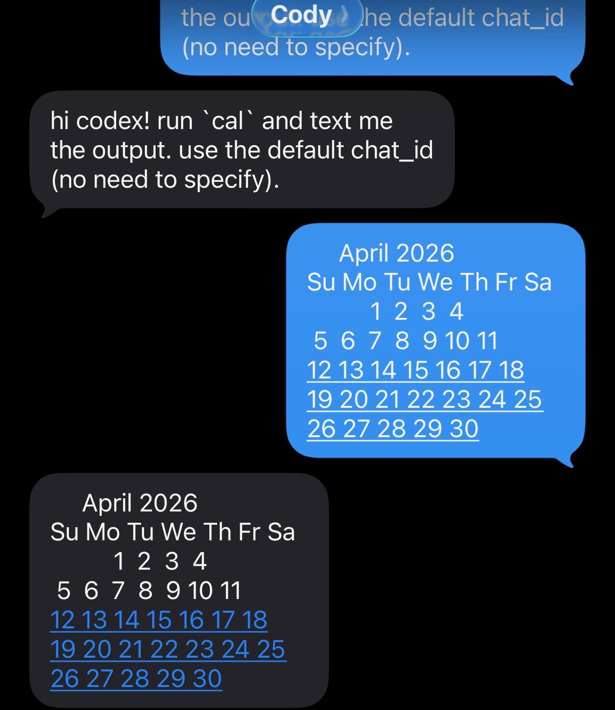
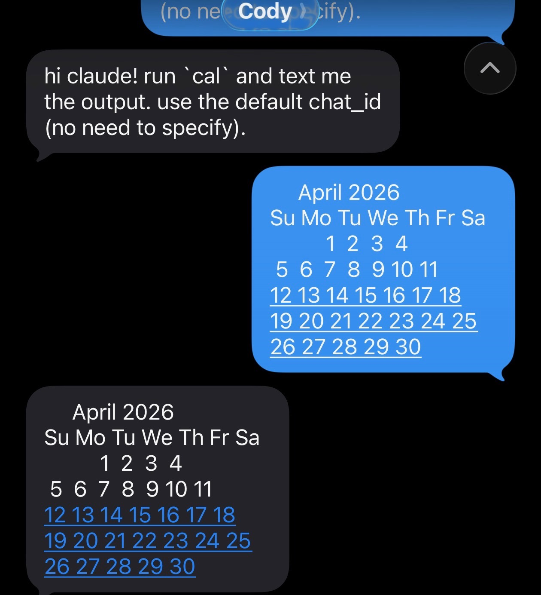

# imessage-plugin

Text your coding agent. Get a reply back in Messages.

`dkdc-io-imessage` is a Rust MCP server for macOS. Point Codex CLI, Claude
Code, or any stdio MCP client at one binary and it can:

- send iMessage with `reply(chat_id, text)`
- search your chats with `list_messages(query, limit)`
- fetch one message by GUID with `read_message(id)`

Local allowlist only. Empty config fails closed.

[crates.io](https://crates.io/crates/dkdc-io-imessage) ·
[docs](crates/dkdc-io-imessage/README.md) ·
[install script](https://dkdc.sh/imessage-plugin/install.sh)

## A live round-trip

A text arrives. Codex runs `cal`. The calendar comes back as iMessage.

```text
╭─────────────────────────────────────────╮
│ >_ OpenAI Codex (v0.0.0)                │
│ model:       gpt-5.4                    │
│ directory:   /private/tmp               │
│ permissions: YOLO mode                  │
╰─────────────────────────────────────────╯

› channel envelope
  from: owner
  ts: 2026-04-18T00:50:58Z

  hi codex! run `cal` and text me the output. use the default
  chat_id (no need to specify).


• Running cal locally, then I'll send the exact output to your
  default iMessage chat.

• Ran cal
  └      April 2026
    Su Mo Tu We Th Fr Sa
              1  2  3  4
     5  6  7  8  9 10 11
    12 13 14 15 16 17 18
    19 20 21 22 23 24 25
    26 27 28 29 30

• Sending the cal output to your default chat now.

• Called
  └ imessage.reply({"text":"     April 2026       \n..."})
    {"chat_id": "any;-;+1XXXXXXXXXX", "sent": true}

• Sent this to your default chat.
```



This is the whole pitch: your agent can stay in the terminal while you stay on
your phone.

## Same plugin, Claude Code

Same binary. Same three tools. Same round-trip.

```text
cd /private/tmp && claude --mcp-config /tmp/bare-claude-mcp.json --allowedTools 'mcp_
_imessage__reply,Bash'
 cody@dkdc  ~/netsky  main  2026/04/18 01:50:12
❯ cd /private/tmp && claude --mcp-config /tmp/bare-claude-mcp.json --allowedTools 'mc
p__imessage__reply,Bash'
╭─── Claude Code v2.1.114 ──────────────────────────────────────────────────────────╮
│                                                    │ Tips for getting started     │
│                 Welcome back Cody!                 │ Run /init to create a CLAUD… │
│                                                    │ ──────────────────────────── │
│                       ▐▛███▜▌                      │ Recent activity              │
│                      ▝▜█████▛▘                     │ 21m ago  Check my most rece… │
│                        ▘▘ ▝▝                       │ 22m ago  hi claude! run `ca… │
│        Opus 4.7 (1M context) · Claude Max ·        │ 3d ago   list the tools you… │
│        cody@dkdc.dev's Organization                │ /resume for more             │
│                    /private/tmp                    │                              │
╰───────────────────────────────────────────────────────────────────────────────────╯

❯ hi claude! run `cal` and text me the output. use the default chat_id (no need to
  specify).

⏺ Bash(cal)
  ⎿       April 2026
     Su Mo Tu We Th Fr Sa
               1  2  3  4
     … +4 lines (ctrl+o to expand)

  Called imessage (ctrl+o to expand)

⏺ Sent the April 2026 cal output to you.

─────────────────────────────────────────────────────────────────────────────────────
❯ 
─────────────────────────────────────────────────────────────────────────────────────
  -- INSERT --
```



## Why this exists

- one binary: `cargo install dkdc-io-imessage`
- no framework lock-in: Codex CLI, Claude Code, or any stdio MCP client
- real Messages integration: send via AppleScript, read from `chat.db`
- tight surface area: three tools, no extra daemon, no event bus
- fail closed: no allowlist means no access

## Install

```sh
# no rust? one line:
curl -LsSf https://dkdc.sh/imessage-plugin/install.sh | sh

# already have cargo:
cargo install dkdc-io-imessage
```

Then:

1. grant Full Disk Access to the host process that will run the binary
2. populate `~/.config/dkdc-io/imessage/access.toml`
3. point your client at `dkdc-io-imessage --stdio`

Full setup and config snippets for Codex and Claude Code live in the
[crate README](crates/dkdc-io-imessage/README.md).

## Security posture

- `reply` only sends to allowlisted handles or `self.chat_id`
- `list_messages` and `read_message` never surface non-allowlisted chats
- AppleScript runs with argv, not string interpolation
- empty allowlist fails closed by default

The anti-regression coverage lives in `tests/injection.rs` and
`tests/stdio_smoke.rs`. A live Claude parity round-trip test lives in
`crates/dkdc-io-imessage/tests/claude_parity.rs` and is documented in
`crates/dkdc-io-imessage/tests/claude_parity.md`.

## Develop

```sh
cargo fmt --all -- --check
cargo clippy --workspace --all-targets -- -D warnings
cargo test --workspace
```

## Prior art

This is an independent Rust implementation inspired by Anthropic's official
iMessage plugin for Claude Code
([anthropics/claude-plugins-official/external_plugins/imessage][upstream]).
That project established the shape: stdio MCP, `chat.db` reads, AppleScript
send, local allowlist. This repo keeps that shape and ships it as one Rust
binary for any MCP-over-stdio client.

[upstream]: https://github.com/anthropics/claude-plugins-official/tree/main/external_plugins/imessage

## License

Dual MIT OR Apache-2.0.
